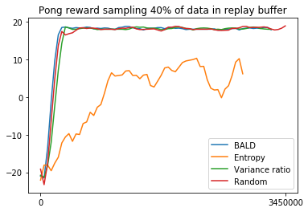
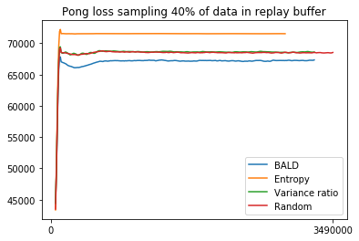

# Active-Actor-Mimic
These experiments apply the ideas from [active learning](http://openaccess.thecvf.com/content_cvpr_2018/papers/Beluch_The_Power_of_CVPR_2018_paper.pdf) to [Actor Mimic](https://arxiv.org/pdf/1511.06342.pdf). The AMN netowrk picks the most uncertain examples using acquisitions functions and then asks an expert network to label these examples. After, the AMN network is trained on the labelled examples.

A comparision of acquision functions
=====
Implementation details
----
The agent first randomly performs 50,000 steps and adds the samples to a replay buffer of size 100,000. After the agent ranks the samples in the replay buffer using the acquisition functions and trains on a percentage of the most uncertain samples on every 10,000th step. Note that the deep Q-network uses monte-carlo dropout to compute the acquisition function.

Results
----
The experiments are performed on a variety of acquisition functions described in the active learning paper. And, different percentage of samples from the replay buffer are used to train the network. Regardless, the results show that the BALD method is better than the rest.

 

 

Two visualizations of the most uncertained examples are shown below. The left GIF are uncertain examples picked using the entropy function, and the right GIF are uncertain examples picked using the BALD function.

 

Two more visualizations of the most uncertained examples are shown below. The left GIF are uncertain examples picked using the variance ratio function, and the right GIF are uncertain examples picked using the random function. 

 

Analysis
----
As shown in the results, the netowrk trained on samples picked by entropy function performed quite poorly. The entropy function tends to select samples where the outputs of the deep Q-netowrk are equal or similar. In fact, this happens often in reinforcement learning. In many frames of the game, agent's action does not have immediate impact on the game, and as a result, the q-values at these frames are nearly identical. After inspecting the q-values predicted by the expert network in the notebook, the entropy function indeed picks samples where the outputs are nearly equal.The variance ratio suffers from a similar problem where the outputs are nearly equal, resulting in high entropy. However, the variance ratio is shown to perform slightly better than picking samples randomly.

The acquisition function BALD clearly performed better than the random function that chooses samples randomly. The BALD acquisition doesn't suffer from the same problem as the entropy function. When the entropy of the output is high, the BALD function will output a small uncertainty rating as long as the outputs using various dropout masks are stable. 

Similar experiments for pong
=====
Results
---- 
 

 

Two visualizations of the most uncertained examples are shown below. The left GIF are uncertain examples picked using the entropy function, and the right GIF are uncertain examples picked using the BALD function.

 

Two more visualizations of the most uncertained examples are shown below. The left GIF are uncertain examples picked using the variance ratio function, and the right GIF are uncertain examples picked using the random function. 

 